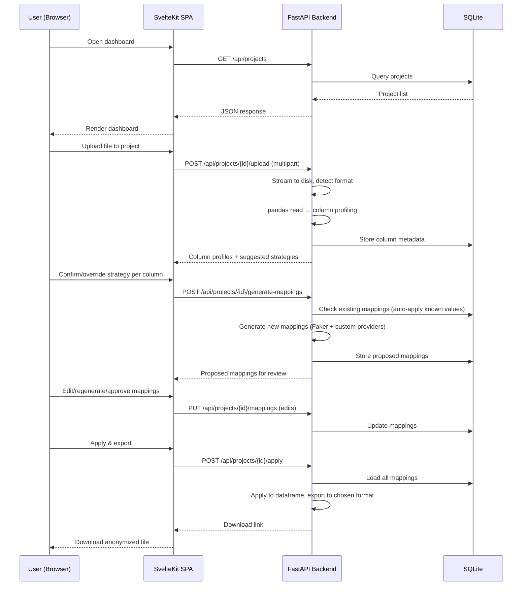

# feat: Build data anonymizer web app

## Summary

Greenfield monorepo (FastAPI backend + SvelteKit frontend) implementing a column-by-column anonymization workflow with deterministic project-scoped mappings in SQLite, format-preserving fakers for product/retail data, rank-preserving numeric jitter with histogram preview, and bidirectional reverse lookup.

---

## Problem Frame

Manual data anonymization is tedious and doesn't scale. The tool automates the existing manual workflow (sort → map → replace) while adding statistical shape preservation and format-aware faking that generic anonymizers don't offer. See origin doc for full context.

---

## Requirements

Carried from origin. R-IDs match the requirements doc.

- R1–R4: Project management (dashboard, CRUD, SQLite per project, isolation)
- R5–R7: File handling (CSV/XLSX/JSON/Parquet in, user-chosen format out)
- R8–R10: Column strategy assignment (auto-detect, available strategies, confirm/override)
- R11–R15: Mapping review and editing (show unique values, regenerate, edit, bulk rules, auto-apply)
- R16–R19: Numeric preservation (distribution shape, histogram preview, manual override, null patterns)
- R20–R24: Format-preserving fakes (UPC/GTIN, company names, phone/email, SKU patterns, dirty-data fidelity)
- R25–R27: Reverse lookup (search bar, clickable cells, operator-only)
- R28–R29: Determinism (same project = same output, different projects = different output)

**Origin flows:** F1 (first-file anonymization), F2 (subsequent-file anonymization), F3 (reverse lookup)
**Origin acceptance examples:** AE1 (cross-file mapping reuse), AE2 (UPC dirty-data fidelity), AE3 (numeric distribution + nulls), AE4 (SKU pattern matching)

---

## Scope Boundaries

- Desktop app packaging (Electron/Tauri) — deferred to v2
- User accounts, authentication, or multi-user collaboration
- Database connections as input source
- Free-text anonymization (addresses, notes, comments)
- Differential privacy guarantees
- YAML/JSON config export as shareable "recipe"
- Hosted deployment — runs locally only
- Undo/version history within a project
- Transformation report / audit trail export
- CI/CD pipeline
- Automated frontend tests (backend test coverage is sufficient for v1)

### Deferred to Follow-Up Work

- Dark mode / theming
- i18n / localization
- Database migration framework (schema is simple enough for manual management in v1)

---

## Context & Research

### Relevant Code and Patterns

Greenfield project — no existing code. Patterns established by this plan.

### External References

**FastAPI + SvelteKit architecture:**
- Monorepo: flat `backend/` + `frontend/` split at root
- Dev: Vite proxy (port 5173) forwards `/api/*` to FastAPI (port 8000)
- Prod: SvelteKit `adapter-static` builds SPA; FastAPI serves via `StaticFiles(html=True)`
- File upload: stream to disk with `aiofiles`, then pandas reads from saved path
- Progress: SSE via `sse-starlette` (`from sse_starlette.sse import EventSourceResponse`)
- Svelte 5 runes (`$state`, `$derived`, `$effect`) for state management; class-based `.svelte.ts` modules for shared state

**SQLite (local single-user):**
- WAL mode, `synchronous=NORMAL`, single lifespan-scoped connection
- `check_same_thread=False` (safe for single-user single-process)
- `conn.row_factory = sqlite3.Row` for dict-like access

**Anonymization techniques:**
- UPC/GTIN check digits: GS1 mod-10 algorithm (5-line inline implementation)
- Numeric jitter: rank-preserving perturbation preserves rank order, percentiles, and approximate mean/variance at small n (100–5000 rows). Post-hoc variance correction: scale result by `sqrt(Var(original) / Var(perturbed))`
- Column type detection: specificity-ordered regex cascade (email → phone → UPC/GTIN → date → SKU → name → generic). Threshold: >80% of non-null values match. UPC distinguished from generic 12-digit numbers via check-digit validation (random 12-digit numbers have only 10% chance of valid check digit)
- SKU pattern extraction: character-class segmentation (`WM-8842-A` → `AA-9999-A`), then random fill per slot
- Custom Faker providers: `BaseProvider` subclasses for domain-specific fakers; `DynamicProvider` for curated name pools

---

## Key Technical Decisions

- **Monorepo with flat split**: `backend/` and `frontend/` at root. No `packages/` or workspace overhead for a single tool. Pydantic schemas are source of truth; TypeScript types duplicated manually.
- **SPA mode for SvelteKit**: `ssr = false` with `adapter-static`. No server-side rendering needed for a local tool. Simplifies the build and eliminates hydration complexity.
- **Single SQLite connection on app lifespan**: No connection pool. Connection opened in FastAPI's `lifespan` context manager, closed on shutdown. Sufficient for single-user local tool.
- **SSE over WebSockets for progress**: One-directional (server → client) is all that's needed for file processing progress. Simpler than WebSocket with auto-reconnect.
- **Rank-preserving perturbation as default jitter**: Maintains correlation structure and percentiles reliably at small n. Gaussian noise with mean correction as fallback for columns where exact mean matters more than rank. (see origin: docs/brainstorms/2026-05-16-anonymizer-requirements.md)
- **Inline UPC/GTIN check digit algorithm**: 5-line mod-10 implementation. No library dependency for trivial math.
- **Template syntax for bulk pattern rules**: Two flavors — word-category templates (`[Adjective] [Noun] [4-digit]`) for human-readable names, character-class templates (`AA-9999-A`) for structured codes. No regex exposed to the user.
- **~200 curated company/store names**: Sufficient pool to avoid obvious repeats at expected data sizes. Organized by plausible business categories (food, retail, wholesale, etc.).

---

## Open Questions

### Resolved During Planning

- **Column detection heuristics (R8)**: Specificity-ordered cascade with >80% match threshold. UPC vs generic numeric distinguished by check-digit validation.
- **Bulk pattern rule syntax (R14)**: Template-based — word-category for names, character-class for codes. No regex.
- **UPC/GTIN generation (R20)**: Inline GS1 mod-10 algorithm. No external library.
- **Company name pool size (R21)**: ~200 names, categorized by business type.
- **Numeric jitter method (R16)**: Rank-preserving perturbation default, Gaussian noise alternative. Post-hoc variance correction for both.

### Deferred to Implementation

- Exact segmentation edge cases for SKU patterns with variable-length parts
- Specific word categories and adjective/noun pools for word-category templates
- Histogram rendering library choice (lightweight charting in Svelte — likely a small SVG component or Chart.js)
- Exact SSE event schema for processing progress updates

---

## Output Structure

```
internal-data-anonymizer/
├── backend/
│   ├── app/
│   │   ├── __init__.py
│   │   ├── main.py
│   │   ├── db.py
│   │   ├── schemas.py
│   │   ├── routers/
│   │   │   ├── projects.py
│   │   │   ├── upload.py
│   │   │   ├── columns.py
│   │   │   ├── mappings.py
│   │   │   └── export.py
│   │   └── services/
│   │       ├── ingest.py
│   │       ├── detector.py
│   │       ├── engine.py
│   │       ├── jitter.py
│   │       └── fakers/
│   │           ├── __init__.py
│   │           ├── retail.py
│   │           ├── identifiers.py
│   │           └── patterns.py
│   ├── tests/
│   │   ├── test_detector.py
│   │   ├── test_engine.py
│   │   ├── test_jitter.py
│   │   └── test_fakers.py
│   └── requirements.txt
├── frontend/
│   ├── src/
│   │   ├── routes/
│   │   │   ├── +layout.svelte
│   │   │   ├── +layout.ts
│   │   │   ├── +page.svelte              (dashboard)
│   │   │   └── projects/
│   │   │       └── [id]/
│   │   │           ├── +page.svelte       (project view)
│   │   │           ├── upload/+page.svelte
│   │   │           ├── review/+page.svelte
│   │   │           └── lookup/+page.svelte
│   │   ├── lib/
│   │   │   ├── api.ts
│   │   │   ├── stores/
│   │   │   │   ├── projects.svelte.ts
│   │   │   │   └── review.svelte.ts
│   │   │   └── components/
│   │   │       ├── ColumnCard.svelte
│   │   │       ├── DataPreview.svelte
│   │   │       ├── Histogram.svelte
│   │   │       ├── MappingTable.svelte
│   │   │       ├── PatternRuleEditor.svelte
│   │   │       └── SearchBar.svelte
│   │   └── app.html
│   ├── svelte.config.js
│   ├── vite.config.ts
│   └── package.json
├── scripts/
│   └── dev.ps1
├── CLAUDE.md
├── README.md
└── .gitignore
```

---

## High-Level Technical Design

> *This illustrates the intended approach and is directional guidance for review, not implementation specification. The implementing agent should treat it as context, not code to reproduce.*



---

## Implementation Units

### U1. Project scaffolding and database

**Goal:** Establish the monorepo structure, dev workflow, and SQLite foundation so subsequent units have a running app to build on.

**Requirements:** R3, R4

**Dependencies:** None

**Files:**
- Create: `backend/app/__init__.py`, `backend/app/main.py`, `backend/app/db.py`, `backend/app/schemas.py`, `backend/requirements.txt`
- Create: `frontend/src/app.html`, `frontend/src/routes/+layout.svelte`, `frontend/src/routes/+layout.ts`, `frontend/svelte.config.js`, `frontend/vite.config.ts`, `frontend/package.json`
- Create: `scripts/dev.ps1`
- Modify: `.gitignore` (add `node_modules/`, `frontend/build/`, `backend/data/`, `backend/uploads/`, `__pycache__/`, `.venv/`)

**Approach:**
- FastAPI app with lifespan context manager that opens/closes the SQLite connection
- SQLite pragmas: WAL mode, synchronous=NORMAL, foreign_keys=ON, busy_timeout=5000
- SvelteKit configured as SPA (`ssr = false`, `adapter-static` with `fallback: 'index.html'`)
- Vite config with proxy: `/api` → `http://localhost:8000`
- Dev script starts both `uvicorn` and `vite dev`
- Database schema: `projects` table (id, name, created_at)

**Patterns to follow:**
- FastAPI lifespan pattern for connection management
- SvelteKit adapter-static SPA configuration

**Test scenarios:**
- Happy path: FastAPI starts, returns 200 on health endpoint; SvelteKit dev server starts and proxies /api requests to FastAPI
- Happy path: SQLite database file created on first startup with correct pragmas (WAL, foreign keys)

**Verification:**
- Both servers start with `scripts/dev.ps1`
- Browser at localhost:5173 loads the SvelteKit shell
- `/api/health` returns 200

---

### U2. Project dashboard

**Goal:** Landing page with project CRUD — user can create, list, open, and delete projects.

**Requirements:** R1, R2, R3, R4

**Dependencies:** U1

**Files:**
- Create: `backend/app/routers/projects.py`
- Create: `frontend/src/routes/+page.svelte`
- Create: `frontend/src/lib/api.ts`
- Create: `frontend/src/lib/stores/projects.svelte.ts`
- Modify: `backend/app/main.py` (register router)
- Modify: `backend/app/db.py` (ensure projects table DDL)

**Approach:**
- REST endpoints: GET /api/projects, POST /api/projects, DELETE /api/projects/{id}
- Each project gets its own SQLite DB file in `backend/data/projects/{id}/mappings.db`
- Dashboard shows project cards with name, creation date, file count
- Svelte 5 class-based store for project list state
- API wrapper module (`api.ts`) with typed fetch helper

**Patterns to follow:**
- FastAPI router with Pydantic response models
- Svelte 5 runes for reactive state (`$state`, `$derived`, `$effect`)

**Test scenarios:**
- Happy path: Create project → appears in list with correct name and date
- Happy path: Delete project → removed from list, SQLite file deleted
- Edge case: Create project with duplicate name → succeeds (names are not unique keys)
- Edge case: Delete non-existent project → returns 404
- Error path: GET /api/projects when data directory doesn't exist → creates it and returns empty list

**Verification:**
- Dashboard renders in browser with create/delete functionality working end-to-end

---

### U3. File upload and column detection

**Goal:** Upload a file into a project, ingest it with pandas, profile each column, and auto-suggest an anonymization strategy.

**Requirements:** R5, R7, R8, R9

**Dependencies:** U2

**Files:**
- Create: `backend/app/routers/upload.py`
- Create: `backend/app/services/ingest.py`
- Create: `backend/app/services/detector.py`
- Create: `backend/tests/test_detector.py`
- Modify: `backend/app/main.py` (register router)

**Approach:**
- Upload endpoint streams file to disk via `aiofiles` in 1MB chunks with size validation
- Format detection by extension, then pandas read (csv, xlsx via openpyxl, json, parquet)
- Column profiler collects: dtype, unique count, null rate, sample values, value length stats
- Auto-detect engine: specificity-ordered cascade — email → phone → UPC/GTIN (12/13 digits + check-digit validation) → date (pd.to_datetime coerce) → SKU (mixed alpha-numeric with delimiter pattern) → name (no digits, titlecase) → numeric → generic string
- Classification threshold: >80% of non-null values match a pattern
- Strategy suggestion map: email/phone/name → fake, UPC/GTIN/SKU → format-preserve, numeric → jitter, date → jitter, generic string → hash, unknown → passthrough
- Store column profiles and suggested strategies in project DB

**Patterns to follow:**
- FastAPI `UploadFile` with streaming write
- pandas format readers (`read_csv`, `read_excel`, `read_json`, `read_parquet`)

**Test scenarios:**
- Happy path: Upload CSV → columns profiled, strategies suggested for each
- Happy path: Upload XLSX → same profiling behavior as CSV
- Happy path: Upload JSON (array of objects) → each key becomes a column
- Happy path: Upload Parquet → columns profiled correctly
- Happy path: Column of 12-digit numbers where 85% pass UPC check-digit → classified as UPC
- Happy path: Column of 12-digit numbers where 5% pass check-digit → classified as numeric (not UPC)
- Happy path: Column with >80% email-pattern values → classified as email
- Happy path: Column with mixed types (60% numeric, 40% string) → classified as generic string
- Edge case: File with zero rows → column profiles returned with empty stats, strategies still suggested
- Edge case: Column with 100% nulls → strategy suggested as "passthrough"
- Error path: Upload unsupported extension (.pdf) → 400 error
- Error path: File exceeds size limit → 413 error during streaming (not after full upload)

**Verification:**
- Upload a sample CSV and see column profiles with auto-suggested strategies in the API response
- `test_detector.py` passes covering UPC vs numeric distinction and cascade priority

---

### U4. Strategy review UI

**Goal:** Column-by-column interface where the user confirms or overrides the auto-suggested strategy for each column before mapping generation.

**Requirements:** R9, R10

**Dependencies:** U3

**Files:**
- Create: `frontend/src/routes/projects/[id]/review/+page.svelte`
- Create: `frontend/src/lib/stores/review.svelte.ts`
- Create: `frontend/src/lib/components/ColumnCard.svelte`
- Create: `backend/app/routers/columns.py`
- Modify: `backend/app/main.py` (register router)

**Approach:**
- After upload, redirect to review page showing columns one at a time
- Each column card shows: column name, detected type, sample values (5–10), suggested strategy, null rate
- User confirms (next column) or overrides strategy from dropdown
- Available strategies displayed with brief description: fake ("replace with plausible fakes"), jitter ("perturb numbers, preserve distribution"), format-preserve ("match the structural pattern"), hash ("one-way hash"), drop ("remove column from output"), passthrough ("keep original values")
- Progress indicator showing current column / total columns
- API endpoint to save confirmed strategies per column

**Patterns to follow:**
- SvelteKit page with `$state` for current column index and confirmed strategies
- Step-through pattern with previous/next navigation

**Test scenarios:**
- Happy path: Navigate through all columns confirming default strategies → all saved correctly
- Happy path: Override a strategy for one column → saved with the override
- Happy path: Navigate back to a previous column → shows previously confirmed strategy
- Edge case: File with one column → no "next" button, just "confirm and generate"
- Edge case: File with 50 columns → progress indicator shows position clearly

**Verification:**
- Column-by-column flow works in browser: navigate forward/back, confirm, override, proceed to mapping generation

---

### U5. Anonymization engine and custom Faker providers

**Goal:** Generate deterministic anonymized mappings for all strategy types, including format-preserving fakes for product/retail data.

**Requirements:** R11, R20, R21, R22, R23, R24, R28, R29

**Dependencies:** U3

**Files:**
- Create: `backend/app/services/engine.py`
- Create: `backend/app/services/fakers/__init__.py`
- Create: `backend/app/services/fakers/retail.py`
- Create: `backend/app/services/fakers/identifiers.py`
- Create: `backend/app/services/fakers/patterns.py`
- Create: `backend/tests/test_engine.py`
- Create: `backend/tests/test_fakers.py`

**Approach:**
- Engine takes a column's unique values + confirmed strategy → returns a mapping dict (original → anonymized)
- Determinism: Faker seeded with `int(hashlib.sha256((project_salt + column_name + original_value).encode()).hexdigest(), 16)` to ensure same input → same output within a project. Different projects use different salts (generated at project creation). Once mappings are approved and stored in the project DB, they become the authoritative source — the deterministic seed is only used for initial generation. Regeneration (U7) uses an incremented counter and the result overwrites the stored mapping
- Strategy implementations:
  - **fake**: Faker's built-in generators (names, companies, addresses) seeded deterministically
  - **format-preserve**: delegates to custom providers based on detected column type
  - **hash**: SHA-256 truncated to reasonable length
  - **drop**: no mapping needed (column excluded from output)
  - **passthrough**: identity mapping
- Custom Faker providers:
  - `retail.py`: `RetailProvider` with ~200 curated company/store names (DynamicProvider), product categories
  - `identifiers.py`: `UPCProvider` (mod-10 check digit), `GTINProvider`, `PhoneProvider` (valid area codes), `EmailProvider` (plausible domains)
  - `patterns.py`: `PatternProvider` — character-class segmentation of original values, then random fill matching the template. Handles variable-length segments
- Dirty-data fidelity: for format-preserve columns, detect what percentage of originals are invalid (e.g., bad check digits). Generate the same percentage of invalid fakes by intentionally corrupting the check digit on a random subset

**Patterns to follow:**
- Faker `BaseProvider` subclass pattern with `self.random_element` and `self.random_int`
- `DynamicProvider` for simple curated pools

**Test scenarios:**
- Covers R28. Happy path: Same value in same project always maps to same fake → deterministic
- Happy path: Same value in different projects maps to different fakes
- Happy path: "fake" strategy with name-like column → generates plausible names from Faker
- Happy path: "hash" strategy → produces consistent hex string
- Happy path: "passthrough" → returns original value unchanged
- Covers AE2. Happy path: UPC column with 92 valid + 8 invalid → output has ~92 valid + ~8 invalid fakes
- Happy path: GTIN-13 generation → 13 digits with valid check digit
- Happy path: Phone generation → format-correct with valid US area code patterns
- Happy path: Email generation → user@plausible-domain.com format
- Covers AE4. Happy path: SKU column "WM-8842-A" → pattern `AA-9999-A` detected, fakes match pattern
- Edge case: Column with a single unique value → mapping contains one entry
- Edge case: SKU column with mixed patterns (80% `AA-9999-A`, 20% `AAA-99`) → dominant pattern used for generation
- Edge case: Curated name pool exhausted (more unique values than pool size) → falls back to Faker-generated names with numeric suffix

**Verification:**
- `test_engine.py` and `test_fakers.py` pass, covering determinism, format correctness, and dirty-data fidelity

---

### U6. Numeric jitter with histogram preview

**Goal:** Jitter numeric columns to preserve statistical distribution shape, with an inline before/after histogram so the user can verify and optionally adjust.

**Requirements:** R16, R17, R18, R19

**Dependencies:** U5

**Files:**
- Create: `backend/app/services/jitter.py`
- Create: `backend/tests/test_jitter.py`
- Create: `frontend/src/lib/components/Histogram.svelte`
- Modify: `backend/app/services/engine.py` (integrate jitter for numeric strategy)

**Approach:**
- Default: rank-preserving perturbation — add Gaussian noise scaled to `alpha * std`, then re-sort perturbed values to match original rank order. Post-hoc variance correction: scale by `sqrt(Var(original) / Var(perturbed))`
- Alpha parameter: default 0.05, adjustable via UI slider (0.01–0.20)
- Null preservation: null positions recorded before jitter, restored after
- Range preservation: optional clamp to original `[min, max]` (on by default)
- Rounding: match original column's decimal precision
- Histogram data: compute 15–20 bins for before/after, return as JSON arrays for the Svelte component
- Override UI: if histogram looks wrong, user adjusts alpha slider and range clamp toggle, regenerates

**Patterns to follow:**
- numpy for vectorized operations
- scipy.stats for distribution fitting (as validation, not primary method)

**Test scenarios:**
- Covers AE3. Happy path: Numeric column (mean=450, std=120, 15% nulls) → output preserves approximate mean, std, and null rate
- Happy path: Rank order preserved — if value A > value B in original, A > B in output
- Happy path: Default alpha=0.05 produces visually similar histogram
- Edge case: Column with all identical values → output is all identical (jitter produces zero variance)
- Edge case: Column with 2 unique values → rank-preserving still works (binary split maintained)
- Edge case: Column with negative values → jitter handles correctly (no implicit non-negative assumption)
- Edge case: Integer column → output rounded to integers
- Edge case: Column with 100% nulls → all nulls preserved, no jitter applied
- Error path: Column with non-numeric values that slipped through detection → graceful fallback to passthrough

**Verification:**
- `test_jitter.py` passes, including distribution assertion (mean within 5% of original, null rate within 2 percentage points)
- Histogram component renders in browser with before/after bars

---

### U7. Mapping review and edit UI

**Goal:** Display proposed mappings for each column, let the user edit individual values, regenerate all mappings, or set bulk pattern rules.

**Requirements:** R11, R12, R13, R14

**Dependencies:** U4, U5, U6

**Files:**
- Create: `frontend/src/lib/components/MappingTable.svelte`
- Create: `frontend/src/lib/components/PatternRuleEditor.svelte`
- Create: `backend/app/routers/mappings.py`
- Modify: `backend/app/main.py` (register router)
- Modify: `frontend/src/routes/projects/[id]/review/+page.svelte` (extend with mapping review phase)

**Approach:**
- After strategy confirmation (U4), transition to mapping review phase — same column-by-column flow but now showing original → proposed replacement pairs
- Mapping table: scrollable list of all unique values with proposed replacements. Editable replacement field per row
- Regenerate button: generates fresh set of fakes for the column (new seed)
- Bulk pattern rule editor: two modes depending on column type
  - Word-category mode (for name-like columns): template with placeholders like `[Adjective] [Noun] [4-digit]` with category dropdowns
  - Character-class mode (for code-like columns): template preview like `AA-9999-A` with character class selectors
- Pattern applied: all values regenerated using the template, displayed for final review
- For numeric columns (jitter strategy): show the histogram preview (U6) instead of a mapping table. Slider for alpha, toggle for range clamp
- "Approve" button saves finalized mappings to project DB and advances to next column

**Patterns to follow:**
- Svelte 5 reactive bindings for inline editing
- Debounced save for individual mapping edits

**Test scenarios:**
- Happy path: View all proposed mappings for a column → see original and proposed replacement side by side
- Happy path: Edit one mapping → replacement updates, others unchanged
- Happy path: Regenerate → all mappings in column replaced with new fakes
- Happy path: Set bulk pattern rule → all values regenerated matching template
- Happy path: Numeric column → histogram preview shown instead of mapping table
- Edge case: Column with 500 unique values → table scrolls smoothly without lag
- Edge case: Edit a mapping to empty string → validation prevents saving

**Verification:**
- Full mapping review flow works in browser: view, edit, regenerate, pattern rules, approve column-by-column

---

### U8. Apply mappings and export

**Goal:** Apply all approved mappings to the dataframe and export in the user's chosen format.

**Requirements:** R5, R6, R28

**Dependencies:** U7

**Files:**
- Create: `backend/app/routers/export.py`
- Create: `backend/app/services/applier.py`
- Modify: `backend/app/main.py` (register router)
- Modify: `frontend/src/routes/projects/[id]/review/+page.svelte` (add export step after all columns approved)

**Approach:**
- After all columns approved, show export options: choose output format (CSV, XLSX, JSON, Parquet)
- Apply endpoint: load original dataframe, load all mappings from project DB, apply column-by-column
  - For generative columns (fake, format-preserve): replace via mapping dict
  - For jitter columns: apply the stored jittered values
  - For hash columns: apply stored hashes
  - For drop columns: exclude from output
  - For passthrough: keep original
- Export to chosen format, return as file download
- Store the export as a project artifact (filename, format, timestamp) in project DB

**Patterns to follow:**
- pandas `DataFrame.replace()` for mapping application
- FastAPI `FileResponse` or `StreamingResponse` for download

**Test scenarios:**
- Happy path: Apply all mappings and export as CSV → file downloads with correct anonymized values
- Happy path: Export as XLSX → valid Excel file with anonymized data
- Happy path: Export as JSON → valid JSON array with anonymized data
- Happy path: Export as Parquet → valid Parquet file
- Happy path: Dropped columns are absent from output
- Happy path: Passthrough columns have original values
- Edge case: Export format different from input format → conversion works correctly
- Edge case: Column with nulls → nulls preserved in export (not replaced with "None" string)
- Integration: Covers AE1 partially — verify that values mapped in a previous file's session are consistently applied

**Verification:**
- Upload a sample CSV, complete the full workflow, download anonymized CSV, inspect that all mappings were applied correctly

---

### U9. Reverse lookup

**Goal:** Search bar and clickable cells to trace any anonymized value back to its original.

**Requirements:** R25, R26, R27

**Dependencies:** U8

**Files:**
- Create: `frontend/src/routes/projects/[id]/lookup/+page.svelte`
- Create: `frontend/src/lib/components/SearchBar.svelte`
- Create: `frontend/src/lib/components/DataPreview.svelte`
- Modify: `backend/app/routers/mappings.py` (add reverse lookup endpoints)
- Modify: `frontend/src/routes/projects/[id]/+page.svelte` (add lookup navigation)

**Approach:**
- Search bar: persistent component in project view header. Type or paste an anonymized value → API query returns the original value, column name, and source file
- SQLite query: `SELECT original, column_name, file_name FROM mappings WHERE anonymized = ?`
- Data preview page: render the most recent anonymized export in a scrollable table. Click any cell → popover shows original value
- Search supports partial matching (LIKE query) for substring searches
- Both search and click-to-reveal pull from the same mappings table in the project DB

**Patterns to follow:**
- Svelte 5 `$state` for search input with debounced API calls
- Popover component for cell click-to-reveal

**Test scenarios:**
- Covers F3. Happy path: Search for "Alpine Market 3847" → shows original "Costco" with column name and source file
- Happy path: Click cell in data preview → popover shows original value
- Happy path: Search with partial match "Alpine" → returns all matching anonymized values
- Edge case: Search for a value that was never mapped → "No results" message
- Edge case: Search for an original value (not anonymized) → "No results" (reverse lookup only works on anonymized values)
- Edge case: Numeric value that was jittered → shows the original numeric value

**Verification:**
- Search bar returns correct original values in browser; cell click reveals original in popover

---

### U10. Multi-file mapping reuse

**Goal:** When a second file is uploaded to the same project, auto-apply existing mappings and only surface new values for review.

**Requirements:** R15, R28

**Dependencies:** U8

**Files:**
- Modify: `backend/app/routers/upload.py` (check existing mappings after profiling)
- Modify: `backend/app/services/engine.py` (separate known-value application from new-value generation)
- Modify: `frontend/src/routes/projects/[id]/review/+page.svelte` (skip columns with no new values, show "X values auto-applied" indicator)

**Approach:**
- After file upload and column profiling, query project DB for existing mappings per column
- For each column: partition unique values into "already mapped" and "new"
- Already-mapped values: auto-apply without review (deterministic by design — same mapping)
- New values: enter the normal review flow (U4 → U7)
- UI indicator: "12 of 15 values auto-applied from previous files. 3 new values to review."
- If a column has zero new values, skip it entirely in the review flow
- If ALL columns have zero new values, skip review entirely and go straight to export

**Patterns to follow:**
- Same column-by-column review flow, filtered to new values only

**Test scenarios:**
- Covers AE1. Happy path: Upload File B to same project as File A → "Costco" auto-maps to same fake as in File A
- Happy path: File B has 3 new store names → only those 3 appear in review
- Happy path: File B has no new values → skip review, go to export
- Happy path: File B has a new column not in File A → full review for that column
- Edge case: File B has same column name but different data types → treated as new column (re-profile)
- Integration: Export File A and File B, join on anonymized store name → join succeeds

**Verification:**
- Upload two files with overlapping values; verify auto-application and that only new values appear in review

---

## System-Wide Impact

- **Interaction graph:** File upload triggers column profiling → strategy suggestion → mapping generation → review → apply → export. Each step depends on the previous. Reverse lookup is a separate read path against the mappings DB.
- **Error propagation:** Upload failures return HTTP errors to the UI. Parsing failures (corrupt file) caught at ingest and surfaced as user-friendly messages. Engine failures (e.g., pattern extraction fails) fall back to hash strategy with a warning.
- **State lifecycle risks:** Interrupted review flow (user closes browser mid-review) — mappings are saved per-column as approved, so partial progress is preserved. User can resume.
- **API surface parity:** Single surface (web UI). No CLI, no programmatic API beyond what the UI consumes.
- **Integration coverage:** The end-to-end flow (upload → review → export → reverse lookup) is the critical path. Backend unit tests cover engine correctness; manual browser testing covers the flow.

---

## Risks & Dependencies

| Risk | Mitigation |
|------|------------|
| SvelteKit 5 is newer; fewer community examples | Research agent gathered current patterns. Svelte 5 runes are stable and well-documented |
| Format-preserving fakers are the most labor-intensive code | Custom Faker providers are straightforward; the research provides working patterns for each type |
| Rank-preserving jitter may produce unexpected results for heavily skewed distributions | Histogram preview lets user visually verify; manual alpha override available |
| Large curated name pool maintenance | Start with ~200; organize by category for easy expansion |
| Character-class pattern extraction may not handle all SKU formats | Dominant-pattern approach covers 80%+ of cases; fall back to hash for outliers |

---

## Documentation / Operational Notes

- README with: project description, installation (pip + npm), usage walkthrough with screenshots, worked example using a public dataset
- One Lailara portfolio piece using the tool's output and linking back to the repo
- CLAUDE.md updated with actual stack, entry point, and conventions after U1

---

## Sources & References

- **Origin document:** [docs/brainstorms/2026-05-16-anonymizer-requirements.md](docs/brainstorms/2026-05-16-anonymizer-requirements.md)
- **FastAPI SSE docs:** https://fastapi.tiangolo.com/tutorial/server-sent-events/
- **SvelteKit SPA mode:** https://svelte.dev/docs/kit/single-page-apps
- **SQLite WAL mode:** https://sqlite.org/wal.html
- **GS1 check digit standard:** https://www.gtin.info/check-digit-calculator/
- **SDC Practice Guide (anonymization methods):** https://sdcpractice.readthedocs.io/en/latest/anon_methods.html
- **Faker custom providers:** https://faker.readthedocs.io/en/stable/
